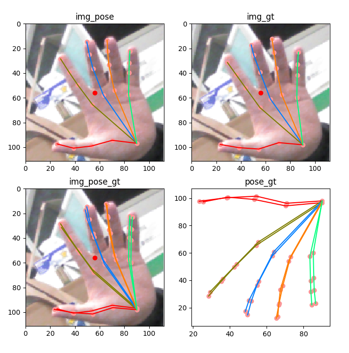
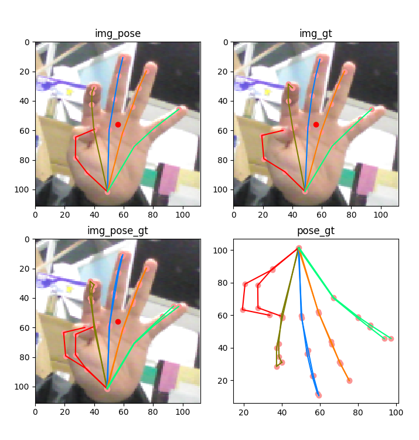
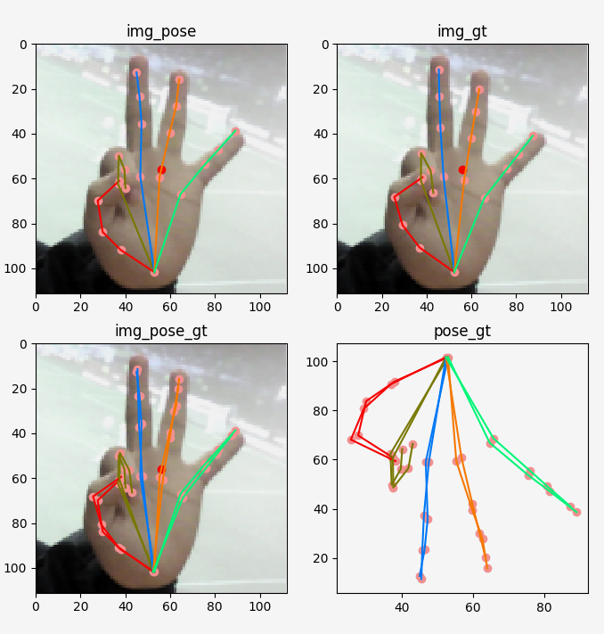
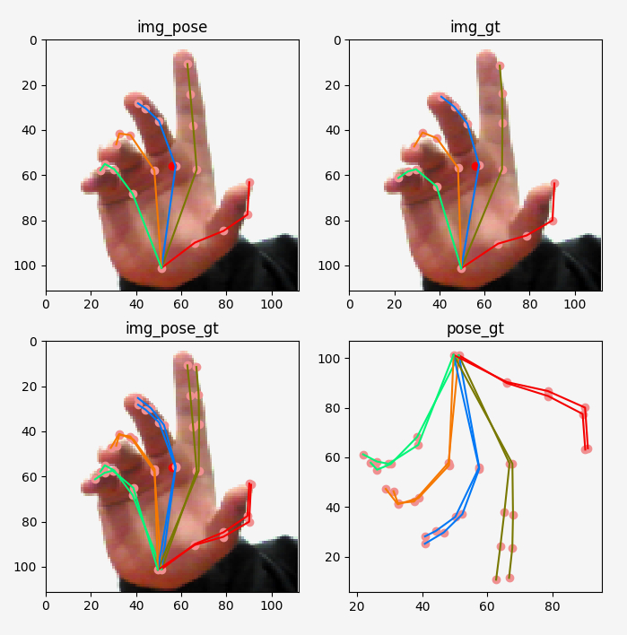

# Light-Ｈand-Keypoint


- Support for torch test.

## Tested the environment that works
- Ubuntu16.04
- Python3.7
- torch1.3.0

## 

```Python
python test.py
```




##  Reference
- [Integral Human Pose Regression](https://github.com/JimmySuen/integral-human-pose.git)
